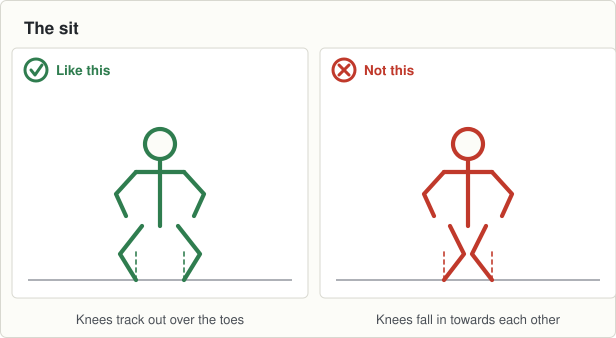

# Session 2, Thursday 27 August

Football · Ease off night. Match pace, then send them home fresher · Theme: Starting · Body shape: the sit · Next match: Football, Saturday 29 August

Match in two days. Same two starts, faster, and nothing new.

## On the ground

- 12 cones, six lanes, 15 metres
- 25 discs beside the lanes
- A ball each

Set it up before the first group arrives and leave it for all three.

## The seventeen minutes

**0 to 2, wake up game: beat the bib.**

- They jog in the grid. You hold a bib up where they can all see it.
- Throw it. Every boy sprints to get a hand to it first, then jogs again.
- Six or seven throws, and throw it in a different direction every time.

**2 to 8, movement: two starts, with a ball.**

- The same standing start and rolling start as Tuesday, ball in hand.
- Four waves of each at match pace. No teaching and no stopping a boy in the lane.
- Let them run. Tonight is for using it, not fixing it.

**8 to 13, body shape: the sit.**

- A disc each. Ten slow sits, five seconds held at the bottom of each.
- Then walk round while they hold and try to make them laugh. If a boy wobbles, he was not really holding it.
- Say the four lines again for anyone who missed Tuesday.

**13 to 17, finish: no challenge game.**

- There is a match on Saturday, so this is where the night stops.
- Walk them in. Ask three boys to name the shape and to show it.
- Hand them to the next station on time.

## Coach one thing

**Nothing. Watch them and let them run.**

- A boy whose start falls apart the moment the ball is in his hands. That is normal at this age.

**Lashing rain.** No change. Nothing tonight goes on the ground.

---

[Print this sheet](02-thu-27-aug.html) · [How to run the station](../../session-guide.md) · [All twenty nights](../../autumn-2026.md) · [Back to session 1](01-tue-25-aug.md) · [On to session 3](03-tue-01-sep.md)
