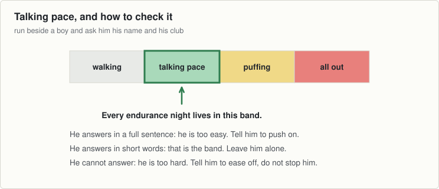

# Session 5, Tuesday 8 September

Hurling · Push night. Teach it slowly, then put the pace up · Theme: Endurance · Next match: Football, Saturday 12 September

New theme. This is not fitness work and it is not a race. It is teaching them one pace and how to find it.

## On the ground

- 10 cones, one loop about 25 by 12 metres
- Hands free

Set it up before the first group arrives and leave it for all three.

## The seventeen minutes

**0 to 2, wake up game: follow the hand.**

- They jog anywhere inside the loop. Nobody stops for two minutes.
- Raise your hand and they speed up. Lower it and they slow down. Flat hand means jog.
- Take them up and down four or five times, and never all the way to a sprint.

**2 to 10, movement: the loop at talking pace.**

- All 25 run the loop the same way at once. Slower boys cut the corners inside.
- Teach the test first: "If you can tell me your name and your club while you run, that is the pace."
- Ninety seconds running, thirty seconds walking. Four goes.
- Run beside three different boys and ask them. Send anyone who cannot answer down a gear.

**10 to 17, challenge game: the two minute loop.**

- Walk one lap together first, so nobody sets off out of breath.
- Two minutes of running, everybody counting his own laps.
- The group adds them up at the end and that number is the target for session 7.
- Nobody's own number is asked for out loud.
- Two minutes walking after it, and the walk is part of the night.

## Coach one thing

**Finding one pace and holding it.**

- Boys who sprint the first lap and walk the third. That is the whole fault of this theme.

**Lashing rain.** No change. Nothing tonight goes on the ground.

---

[Print this sheet](05-tue-08-sep.pdf) · [How to run the station](../../session-guide.md) · [All twenty nights](../../autumn-2026.md) · [Back to session 4](../1-starting/04-thu-03-sep.md) · [On to session 6](06-thu-10-sep.md)
