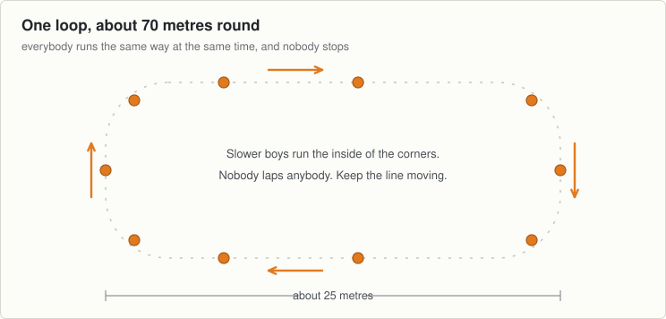

# Session 6, Thursday 10 September

Football · Ease off night. Match pace, then send them home fresher · Theme: Endurance · Body shape: the plank · Next match: Football, Saturday 12 September

Match in two days, so the running gets shorter and nothing new goes in.

## On the ground

- 10 cones, one loop about 25 by 12 metres
- 25 discs inside the loop
- A ball each

Set it up before the first group arrives and leave it for all three.

## The seventeen minutes

**0 to 2, wake up game: traffic in the box.**

- Everybody moving inside the loop, and nobody stops for the whole two minutes.
- Call the way they move: "jog", "sideways", "backwards", "skip", "big steps", "jog".
- Change the call about every fifteen seconds. Keep the pace easy.

**2 to 8, movement: the loop with a ball.**

- Two goes of ninety seconds at talking pace, with a ball in hand, two minutes walking between.
- Same rule as Tuesday. If he cannot answer you, he is going too hard.
- Two goes tonight, not three. There is a match on Saturday.

**8 to 13, body shape: the plank.**

- A disc each. Fifteen seconds, rest, three times.
- On the third one, lift one hand off the ground for five seconds, then the other.
- If his hips swing when the hand comes up, he was not tight to begin with.

**13 to 17, finish: no challenge game.**

- Walk one lap of the loop together, talking.
- Ask two boys: "Could you still talk on that last run?"
- Hand them on. They should leave fresher than they arrived.

## Coach one thing

**Nothing. Ask the talking question and listen to the answer.**

- Any boy who is quiet and red faced. He is going too hard and will not say so.

**Lashing rain.** The plank becomes the sit, held for twenty seconds.

---

[Print this sheet](06-thu-10-sep.pdf) · [How to run the station](../../session-guide.md) · [All twenty nights](../../autumn-2026.md) · [Back to session 5](05-tue-08-sep.md) · [On to session 7](07-tue-15-sep.md)
