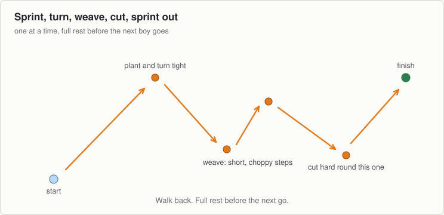
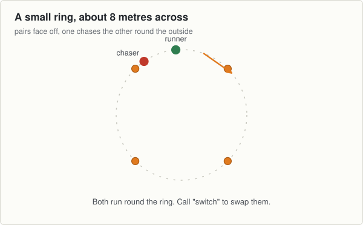

<!-- built: header -->
# Session 6, Thursday 10 September

Football · Full speed night, out of sequence. Match in two days, but tonight goes hard. · Theme: Endurance · Next match: Football, Saturday 12 September
<!-- /built -->

---
n: 6
date: Thursday 10 September
theme: 2-endurance
code: Football
kind: Full speed night, out of sequence. Match in two days, but tonight goes hard.
match: Football, Saturday 12 September
kit:
  - 10 cones: 4 for a small chase ring, and 4 more for the sprint, turn, weave and cut
coach: The turn, not the sprint. A good plant and turn saves more time than a fast straight line.
wet: Take out the turn cone and the cut cone. Curves only tonight, no hard plant and turn on wet grass.
---

The match is two days away, but tonight breaks from the plan: full speed and full rest, not an easy night.

## The station

### 1 to 6 · Movement · Round the ring

- Pair them up around the ring, facing each other, an arm's length apart.
- On "go", the runner moves around the outside of the ring and the chaser follows, trying to close the gap.
- Sharp changes of direction, not a flat sprint. Keep it under control.
- Call "switch" every thirty seconds, so the chaser becomes the runner.

### 6 to 11 · Challenge game · Sprint, turn, weave, cut

- Same pairs from the ring, lined up at the start, so nobody stands round wondering who goes next.
- One at a time. Sprint to the turn cone, plant the outside foot, and turn tight around it.
- Sprint on to the two weave cones and go between them, short choppy steps, not a straight line.
- Cut hard round the last cone and sprint the length back to the finish.
- Full rest between goes. Walking back and breathing easy before he goes again.
- Three goes each, no more. Quality goes first when they are tired and there is no point past that.

## Coach one thing

- Boys who round the turn wide instead of planting and cutting tight.
- The pace goes up tonight, out of its usual place. Watch for tired legs going into Saturday.

<!-- built: links -->
[Print this sheet](06-thu-10-sep.pdf) · [How to run the station](../../session-guide.md) · [All twenty nights](../../autumn-2026.md) · [Back to session 5](05-tue-08-sep.md) · [On to session 7](07-tue-15-sep.md)
<!-- /built -->
