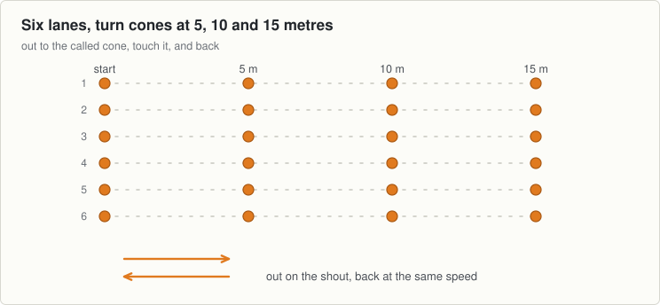
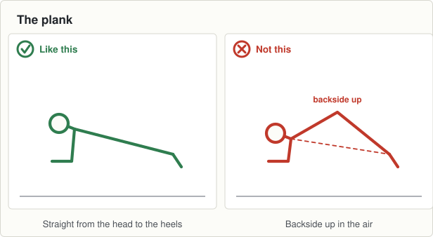

# Session 7, Tuesday 15 September

Football · Push night. Teach it slowly, then put the pace up · Theme: Endurance · Body shape: the plank · Next match: Hurling, Saturday 19 September

The hardest night of the theme. Change of direction goes in on top of the running.

## On the ground

- 24 cones, six lanes with turns at 5, 10 and 15 metres
- 25 discs
- 12 tennis balls, 4 bibs

Set it up before the first group arrives and leave it for all three.

## The seventeen minutes

**0 to 2, wake up game: rob the nest.**

- Four teams, one in each corner, with all the tennis balls in a pile in the middle.
- One boy from each team runs at a time, takes one ball, runs back, and the next boy goes.
- When the middle is empty they may take from another team's corner. Two minutes, no winner called.

**2 to 8, movement: shuttles.**

- Six lanes with a cone at 5, 10 and 15 metres. Four boys to a lane.
- Call a distance. The front boy runs out to that cone, touches it, and runs back at the same speed.
- Keep it continuous for sixty seconds, then thirty seconds rest. Four goes.
- Same pace out and back. A boy who sprints out and walks back has missed the point.

**8 to 13, body shape: the plank.**

- A disc each. Twenty seconds, rest, three times.
- Then the side plank, on one elbow, ten seconds each side.
- Backside down, not up. That is the only thing to fix.

**13 to 17, challenge game: team relay.**

- Five teams of five. Each boy runs one lap of the loop and tags the next.
- Every boy runs twice. Call the group lap total from session 5 and see if they beat it.
- The teams are mixed up every round, so nobody is stuck on a losing team.

## Coach one thing

**The same speed out and back.**

- Boys slowing to a walk before the turn cone rather than running through it.
- The pace going up tonight. It never goes up on a Thursday.

**Lashing rain.** Move the turn cones in a metre. Wet grass and a hard turn is how ankles go.

---

[Print this sheet](07-tue-15-sep.html) · [How to run the station](../../session-guide.md) · [All twenty nights](../../autumn-2026.md) · [Back to session 6](06-thu-10-sep.md) · [On to session 8](08-thu-17-sep.md)
