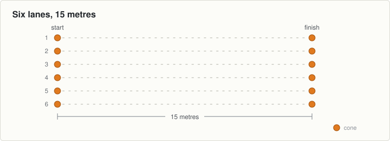

# Session 9, Tuesday 22 September

Hurling · Push night. Teach it slowly, then put the pace up · Theme: Sprints · Body shape: the big step · Next match: Football, Saturday 26 September

New theme. Sprinting is a skill before it is a race, so tonight is about the arms and staying tall.

## On the ground

- 12 cones, six lanes, 15 metres
- 25 discs beside the lanes
- Hands free

Set it up before the first group arrives and leave it for all three.

## The seventeen minutes

**0 to 2, wake up game: wave sprints.**

- They jog anywhere in the grid.
- Shout "go". Every boy sprints ten metres in the direction he is already facing, then jogs again.
- Six goes, with about fifteen seconds of jogging between each one.

**2 to 8, movement: running tall.**

- Six lanes, waves of six, 15 metres at about three quarter pace. This is not a race and say so.
- 1. "Stand tall. Do not let your body fold in the middle."
- 2. "Elbows bent. Hand goes from your pocket to your chin and back."
- 3. "Keep your hands on your own side of your body."
- Six waves. Stand at the side and watch the arms, not the legs.

**8 to 13, body shape: the big step.**

- A disc each, and room in front of him. New shape, so build it in front of them.
- 1. "Big step forward off the disc, longer than a walking step."
- 2. "Bend both knees and drop your back knee towards the ground."
- 3. "Front knee stays over your front foot. Do not let it fall inwards."
- 4. "Push off the front foot to stand up."
- Eight each leg, slowly. Stand in front of a boy and look straight down his front leg.

**13 to 17, challenge game: pair races.**

- Pairs of roughly the same size, one pair to a lane, standing start.
- Fifteen metres. Six races, a new partner each time.
- Now they will run properly fast, which is why the technique came first.

## Coach one thing

**Hands stay on their own side of the body.**

- Arms swinging across the chest. Show them the picture and run beside them.
- Heads rolling from side to side.

**Lashing rain.** No change. Nothing tonight goes on the ground.

---

[Print this sheet](09-tue-22-sep.pdf) · [How to run the station](../../session-guide.md) · [All twenty nights](../../autumn-2026.md) · [Back to session 8](../2-endurance/08-thu-17-sep.md) · [On to session 10](10-thu-24-sep.md)
