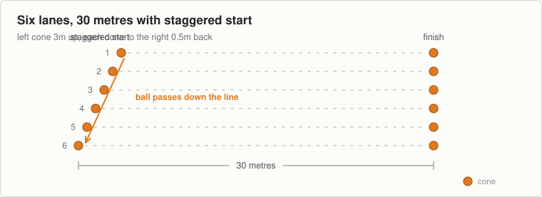

<!-- built: header -->
# Session 10, Thursday 24 September

Football · Full speed night, out of sequence. Match in two days, but tonight goes hard. · Theme: Sprints · Next match: Football, Saturday 26 September
<!-- /built -->

---
n: 10
date: Thursday 24 September
theme: 3-sprints
code: Football
kind: Full speed night, out of sequence. Match in two days, but tonight goes hard.
match: Football, Saturday 26 September
kit:
  - 12 cones, six lanes extended to 30 metres
  - Start cones staggered: left cone 3m up, each cone to the right 0.5m back
  - 6 footballs
coach: Staying at full pace while handling the ball. Do not slow down to pass.
wet: Shorten the sprint if the grass is greasy. Full speed needs good footing.
---

The match is two days away, but tonight breaks from the plan: full speed and full rest, not an easy night.

## The station

### 1 to 6 · Movement · Out and back with hand swap

- Six lanes, four boys to a lane, one ball at the front of each lane.
- Run to the 15 metre mark and back flat out.
- Keep changing the ball from one hand to the other continuously while sprinting.
- Pass the ball to the next boy in line and rest at the start while the other three go.
- Four goes each. Flat out out and back, then relax in line until his next turn.

### 6 to 11 · Challenge game · Full pace line pass

- Move the start cone 3 metres up on the left lane, and each cone to the right 0.5 metres back.
- Waves of six across the lanes, with a single ball starting on the far left.
- Sprint flat out over the full 30 metres at top speed.
- Throw the ball across from left to right down the angled line on the run.
- Nobody slows down to pass or catch. Run through the finish cones, then walk back slowly.
- Five or six waves. Full rest on the walk back before going again.

## Coach one thing

- Slowing to a jog to swap hands or make the pass. The feet stay at full speed.
- The pace goes up tonight, out of its usual place. Watch for tired legs going into Saturday.

<!-- built: links -->
[Print this sheet](10-thu-24-sep.pdf) · [How to run the station](../../session-guide.md) · [All twenty nights](../../autumn-2026.md) · [Back to session 9](09-tue-22-sep.md) · [On to session 11](11-tue-29-sep.md)
<!-- /built -->
