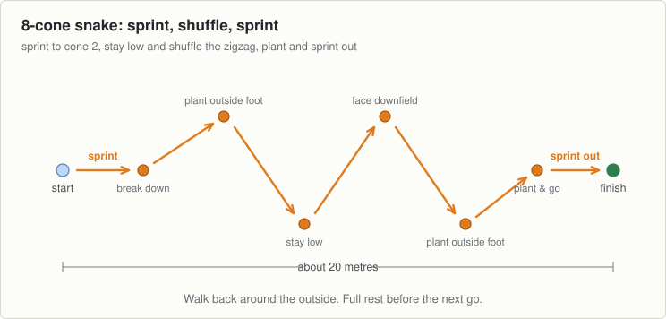

<!-- built: header -->
# Session 11, Tuesday 29 September

Football · Push night. Teach it slowly, then put the pace up · Theme: Sprints · Next match: Hurling, Saturday 3 October
<!-- /built -->

---
n: 11
date: Tuesday 29 September
theme: 3-sprints
code: Football
night: push
match: Hurling, Saturday 3 October
kit:
  - 16 cones: two 8-cone snake lanes, 20 metres long
  - Hands free
coach: Staying low in the shuffle and driving off the outside foot into the sprint.
wet: Widen the zigzag and ease the sharp cuts if the grass is greasy. Full speed needs firm footing.
---

The hardest night of the theme. Linear speed meets lateral agility: sprint in, shuffle the snake, and explode out.

## The station

### 1 to 6 · Movement · Sprint, shuffle, sprint

- Two 8-cone snake lanes side by side, 20 metres long. Teach the pattern at half pace first.
- Sprint 5 metres to cone 2, break down into a lateral shuffle through the zigzag, plant and sprint out past cone 8.
- 1. "Stay low in the tunnel. Do not let your chest or hips rise up when you hit the cones."
- 2. "Keep your chest facing forward down the pitch. Hips square, no crossing your feet."
- 3. "Hard push off the outside foot at each turn to redirect your body."
- Four or five waves, one boy in each lane at a time. Walk back along the outside. Full rest between goes.

### 6 to 11 · Challenge game · Snake races

- Pairs matched by speed, one boy at the start of each snake lane.
- "Go" on the whistle: sprint, shuffle, sprint flat out to the finish line.
- The winner is the first boy through cone 8 who stayed low through every turn without knocking a cone or crossing his feet.
- Switch lanes and pair up with someone new each time.
- Five or six races each. Full rest on the walk back before going again. Quality goes first when tired.

## Coach one thing

- Boys who stand up tall or bounce upright in the shuffle. Keep them low in the tunnel.
- Feet crossing over during the shuffle. Keep the base wide and push off the outside leg.
- Slowing down before the final sprint instead of planting hard and driving forward.

<!-- built: links -->
[Print this sheet](11-tue-29-sep.pdf) · [How to run the station](../../session-guide.md) · [All twenty nights](../../autumn-2026.md) · [Back to session 10](10-thu-24-sep.md) · [On to session 12](12-thu-01-oct.md)
<!-- /built -->
