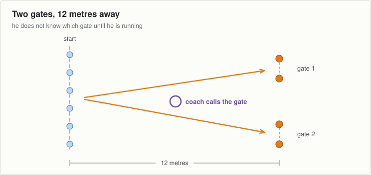

# Session 11, Tuesday 29 September

Football · Push night. Teach it slowly, then put the pace up · Theme: Sprints · Body shape: the big step · Next match: Hurling, Saturday 3 October

The hardest night of the theme. Full speed, full rest, and something to react to.

## On the ground

- 16 cones: six lanes plus two gates at 12 metres
- 25 discs
- Hands free

Set it up before the first group arrives and leave it for all three.

## The seventeen minutes

**0 to 2, wake up game: reaction line.**

- Two lines of boys, back to back down the middle of the grid, an arm's length apart.
- Name one line "blue" and one "red". Call a colour: that line runs, the other line chases for five metres.
- Eight calls. Mix up how long you leave between the call and the last one.

**2 to 8, movement: full speed.**

- Six lanes, waves of six, 15 metres flat out. This is the only night in the theme they go flat out.
- Full rest between waves. A boy should be walking back and breathing easy before he goes again.
- Four or five waves, no more. Quality goes first when they are tired and there is no point past that.

**8 to 13, body shape: the big step.**

- A disc each, hands on the head or a hurl held across the shoulders.
- Six each leg. Taking the hands away makes the balance harder and shows up the weak side.
- Most boys have a bad side and have never noticed. Tell them which one theirs is.

**13 to 17, challenge game: two gates.**

- One gate of cones to the left at 12 metres and one to the right. Boys start on the middle line.
- He sets off. When he is about three metres in, shout "one" or "two" and he runs through that gate.
- One boy at a time from each of three starts, so three going at once. Six goes each.

## Coach one thing

**Reacting without slowing down.**

- Boys who slow to a walk to work out which gate. Call it earlier for them.
- The pace goes up tonight. It never goes up on a Thursday.

**Lashing rain.** Shorten the gates to ten metres so nobody has to turn hard on wet grass.

---

[Print this sheet](11-tue-29-sep.pdf) · [How to run the station](../../session-guide.md) · [All twenty nights](../../autumn-2026.md) · [Back to session 10](10-thu-24-sep.md) · [On to session 12](12-thu-01-oct.md)
