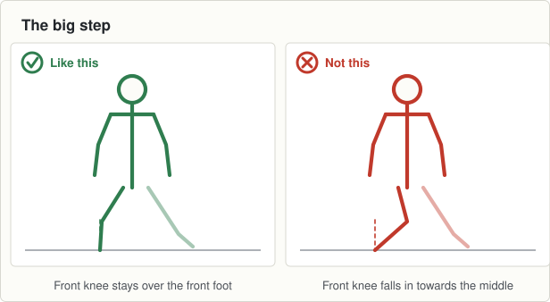

# Session 12, Thursday 1 October

Hurling · Ease off night. Match pace, then send them home fresher · Theme: Sprints · Body shape: the big step · Next match: Hurling, Saturday 3 October

Last night of the theme, a match in two days, and the big step gets checked.

## On the ground

- 12 cones, six lanes, 15 metres
- 25 discs beside the lanes
- A hurl each, 12 bibs

Set it up before the first group arrives and leave it for all three.

## The seventeen minutes

**0 to 2, wake up game: tails.**

- Twelve boys tuck a bib into the back of their shorts so most of it hangs out. The rest have no tail.
- The boys without a tail chase and try to take one. A boy who takes a tail wears it.
- A boy who loses his tail does five big steps, then goes hunting for another. Swap nobody, it sorts itself out. Two minutes.

**2 to 9, movement: four sprints with a hurl.**

- Four waves of six over 15 metres with a hurl, at whatever pace they like.
- Full rest between. Walk back, breathe, go again.
- Stand at the finish line and watch the arms. Say nothing.

**9 to 15, body shape: the big step, checked.**

- They should drop into it without a demonstration. Find out whether they can.
- Say only "big step, left leg" and count to five. Then the right.
- Five each leg. Then ask one boy to show the group and to say what to watch for.

**15 to 17, finish: name the shape.**

- Walk them in.
- Ask three boys: "What is the shape called, and what falls in if you do it badly?"
- Tell them the theme changes on Tuesday and it is stopping.

## Coach one thing

**Nothing. Find out who knows the shape.**

- Any boy whose front knee still falls in. Note his name for the stopping theme, because it is the same fault.

**Lashing rain.** No change.

---

[Print this sheet](12-thu-01-oct.html) · [How to run the station](../../session-guide.md) · [All twenty nights](../../autumn-2026.md) · [Back to session 11](11-tue-29-sep.md) · [On to session 13](../4-stopping/13-tue-06-oct.md)
