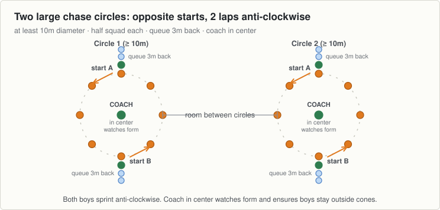

<!-- built: header -->
# Session 12, Thursday 1 October

Hurling · Ease off night. Match pace, then send them home fresher · Theme: Sprints · Next match: Hurling, Saturday 3 October
<!-- /built -->

---
n: 12
date: Thursday 1 October
theme: 3-sprints
code: Hurling
night: ease
match: Hurling, Saturday 3 October
kit:
  - 16 cones: two large circles (at least 10m diameter) with opposite start cones
  - A hurl each and sliotars
coach: Keeping the head up as much as possible and lifting knees for speed.
wet: Keep circles wide and take care on greasy grass. Ease into the turns if slippery.
---

Two large circles, at least 10 metres across, with plenty of room between them. Sprint chasing around the outside: first on foot, then soloing on the hurl.

## The station

### 1 to 6 · Movement · Two-circle running chase

- Two large circles at least 10 metres in diameter, with ample space between them. Half the group at each circle.
- For each circle, break the boys into two groups placed behind opposite cones.
- Waiting boys line up at least 3 metres back from the circle to not impede the runners.
- Coaches stand in the center of the circle to watch form and ensure the boys keep outside the cones.
- On the whistle, the front boy at each cone runs anti-clockwise trying to catch the boy from the other side.
- They complete two laps of the circle, returning to their original cone or stopping wherever one boy catches the other.
- Then the next two boys step forward and repeat the drill. Each boy runs once.
- Focus on sprinting form: keep the head up as much as possible and lift the knees for speed.

### 6 to 11 · Challenge game · Solo chase and circle races

- Repeat of the first drill, but this time soloing a sliotar on the hurl while trying to catch the other boy.
- Same setup: two laps anti-clockwise, lines kept 3 metres back, coach in the center.
- Maintain form under pressure: head up to navigate the curve and lifting knees high for speed.
- If there is time for a third exercise, run a race between the two groups in each circle:
  - Coach throws a sliotar on the ground in front of the starting boys to pick up and go.
  - On completing their laps back to the starting point, each boy throws the sliotar on the ground in front of the next boy in line.
  - First group to get all boys through their laps wins.

## Coach one thing

- Head down watching the ground or sliotar. Keep the chin up and lift knees high.
- Boys crowding the circle. Keep all queues strictly 3 metres back.
- Cutting inside the cones. Runners must stay on the outside perimeter for the full two laps.

<!-- built: links -->
[Print this sheet](12-thu-01-oct.pdf) · [How to run the station](../../session-guide.md) · [All twenty nights](../../autumn-2026.md) · [Back to session 11](11-tue-29-sep.md) · [On to session 13](../4-stopping/13-tue-06-oct.md)
<!-- /built -->
