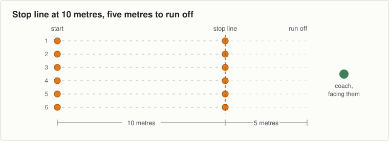

<!-- built: header -->
# Session 14, Thursday 8 October

Football · Ease off night. Match pace, then send them home fresher · Theme: Stopping · Next match: Football, Saturday 10 October
<!-- /built -->

---
n: 14
date: Thursday 8 October
theme: 4-stopping
code: Football
night: ease
match: Football, Saturday 10 October
kit:
  - 18 cones: six lanes, stop line at 10 metres, 5 metres of run off
  - A ball each
coach: Nothing. Watch the boys who stopped upright on Tuesday.
wet: Move the stop line in a metre and keep it at jogging pace.
---

Match in two days. The same stop with a ball in hand, and nothing new.

## The station

### 1 to 6 · Movement · Stopping with a ball

- Six waves, jogging in and stopping on the line in two steps, ball in hand.
- Then six waves at match pace.
- The ball changes nothing about the stop. If it does, he was not solid to begin with.

### 6 to 11 · Finish · Three stops each

- Five waves at match pace and that is the night.
- Walk them in and ask two boys: "How many steps does a stop take?"
- Hand them on. They should leave fresher than they arrived.

## Coach one thing

- A boy who now sinks into the stop without being told. Tell him you saw it.

<!-- built: links -->
[Print this sheet](14-thu-08-oct.pdf) · [How to run the station](../../session-guide.md) · [All twenty nights](../../autumn-2026.md) · [Back to session 13](13-tue-06-oct.md) · [On to session 15](15-tue-13-oct.md)
<!-- /built -->
