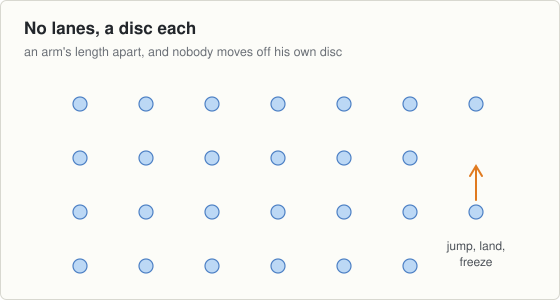

# Session 17, Tuesday 20 October

Hurling · Push night. Teach it slowly, then put the pace up · Theme: Jumping · Next match: Football, Saturday 24 October

New theme, and nothing gets jumped over tonight. The hurdles stay in the bag until the landing is quiet on the spot.

## On the ground

- 4 corner cones
- 25 discs, one per boy
- Hands free. Hurdles stay in the bag

Set it up before the first group arrives and leave it for all three.

## The seventeen minutes

**0 to 2, wake up game: silent bunny hops.**

- Two feet together, hopping anywhere inside the grid. Landings must be silent.
- Walk about with your back turned and listen. Any boy you hear stands out for ten seconds.
- Two minutes. Tell them you are listening, not looking.

**2 to 10, movement: jump and land on the spot.**

- A disc each, and nothing to jump over. Two feet to two feet, straight up and straight down.
- 1. "Bend, swing your arms, jump."
- 2. "Land on the front of your feet, then let your heels down."
- 3. "Bend your knees as you land and keep them apart."
- 4. "Freeze. Two seconds. No noise."
- Ten jumps, then ten more with you walking round listening.
- Then ten with the freeze held for two seconds. Nudge a shoulder, and a boy who wobbles was not holding it.

**10 to 17, challenge game: the quietest group.**

- Split them into three groups of eight. One group jumps, the other two turn their backs and listen.
- Ten jumps together. The listeners say how many they heard.
- Six rounds, so every group jumps twice. The listeners are strict, which is the point.

## Coach one thing

**If you can hear him land, he is landing badly.**

- Straight legs on landing. He must bend to be quiet, so quiet does the coaching for you.
- Knees falling in as he lands. It is the same fault you saw in the stopping theme.

**Lashing rain.** No change. Nothing tonight goes on the ground and nobody jumps over anything.

---

[Print this sheet](17-tue-20-oct.pdf) · [How to run the station](../../session-guide.md) · [All twenty nights](../../autumn-2026.md) · [Back to session 16](../4-stopping/16-thu-15-oct.md) · [On to session 18](18-thu-22-oct.md)
