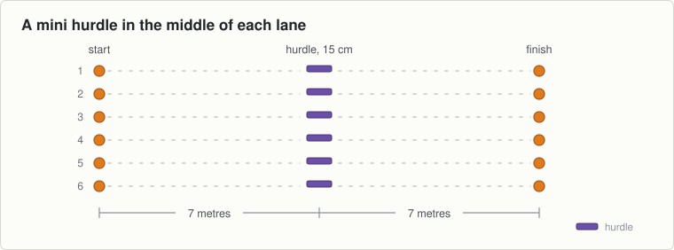

<!-- built: header -->
# Session 20, Thursday 29 October

Hurling · Ease off night. Match pace, then send them home fresher · Theme: Jumping · Next match: Hurling, Saturday 31 October
<!-- /built -->

---
n: 20
date: Thursday 29 October
theme: 5-jumping
code: Hurling
night: ease
match: Hurling, Saturday 31 October
kit:
  - 12 cones, six lanes
  - 6 mini hurdles, 15 cm
  - A hurl each
coach: Nothing. Find out how many of the five themes they can name.
wet: Two feet landings only.
---

Last night before Halloween and the last night of the autumn. Let them jump and then let them go.

## The station

### 1 to 6 · Movement · Hurdles at match pace

- Waves of six over the hurdle with a hurl in hand.
- Each boy picks his own landing, two feet or one. Ten waves.
- Stand at the side and listen. Say nothing.

### 6 to 11 · Finish · The last waves, then in

- Four free waves over the hurdle at whatever pace each boy likes.
- Walk them in with two minutes left.
- Ask the group to name the five themes: starting, endurance, sprints, stopping, jumping.
- That is the autumn finished. Tell them so, and tell them shapes start in November.

## Coach one thing

- How many boys can name all five themes without help. That number is the honest score for the autumn.

<!-- built: links -->
[Print this sheet](20-thu-29-oct.pdf) · [How to run the station](../../session-guide.md) · [All twenty nights](../../autumn-2026.md) · [Back to session 19](19-tue-27-oct.md)
<!-- /built -->
